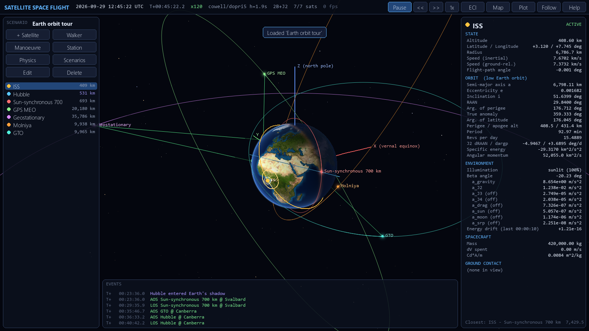
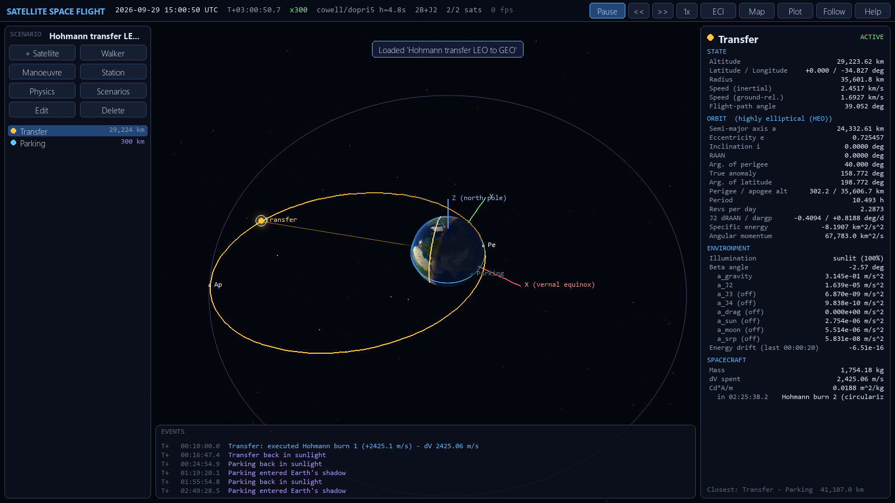
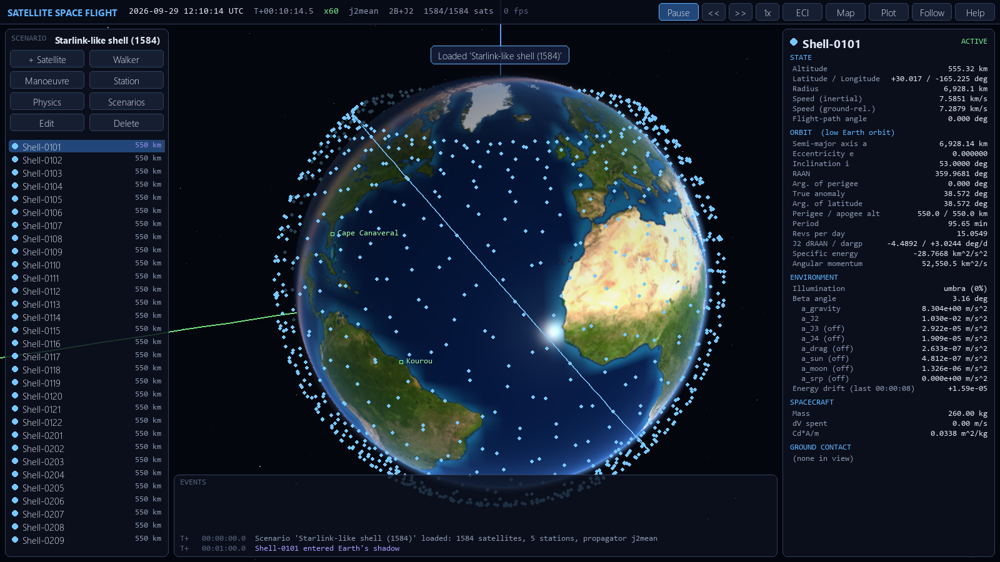
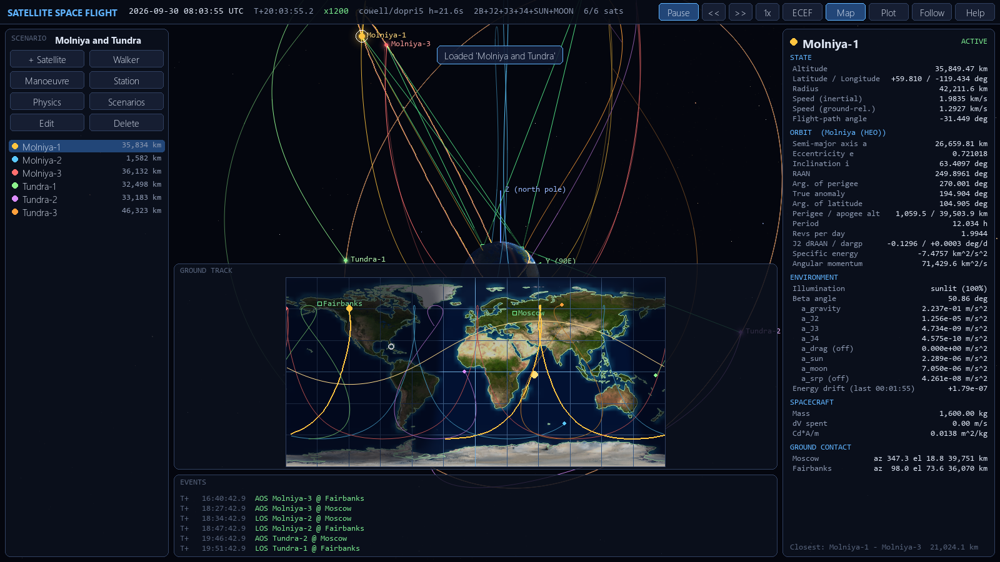
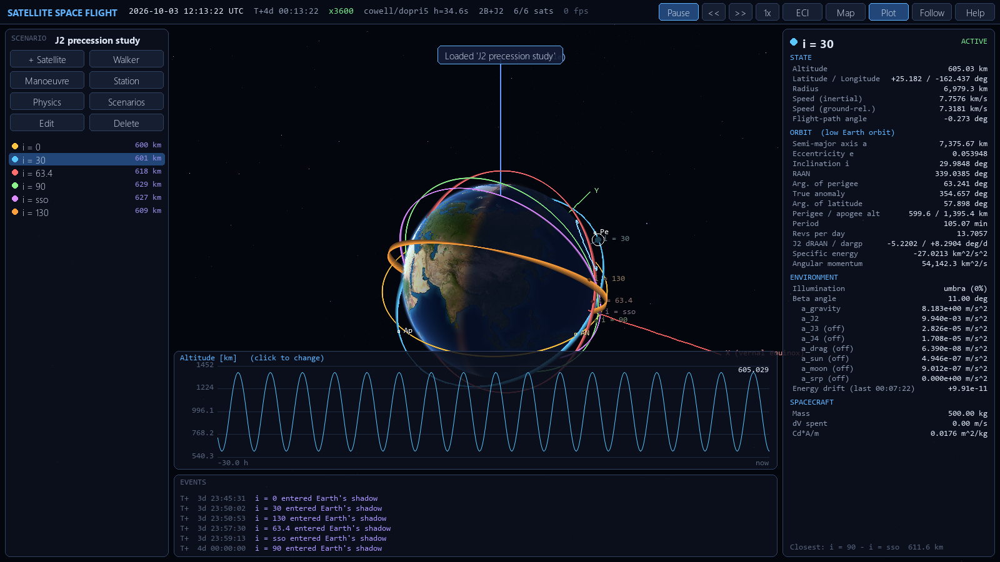
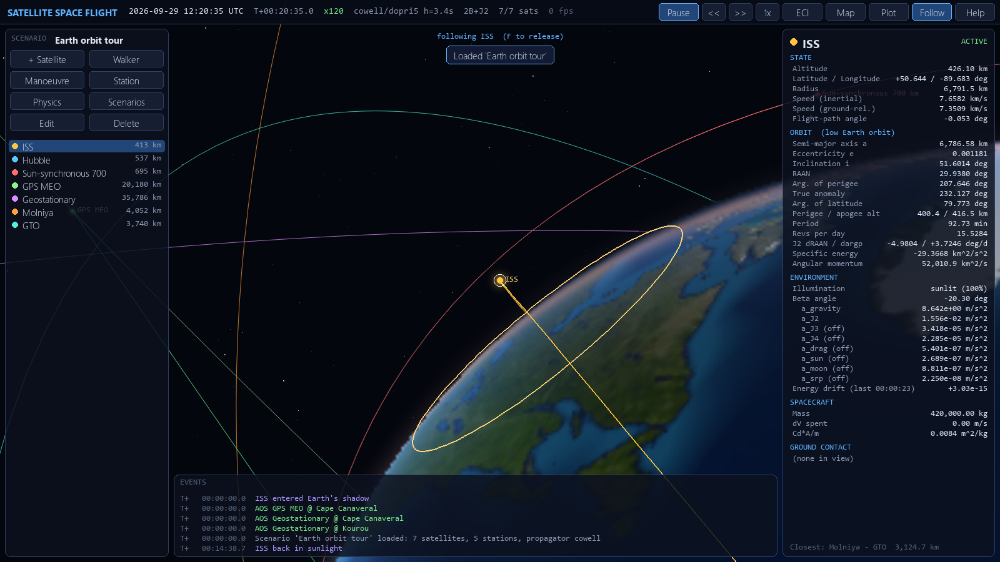

# Satellite Space Flight

An Earth-centred, fully 3-D satellite orbit simulator written entirely in
Python: a numpy physics engine plus an interactive **pygame** front end.
Build scenarios with any number of satellites in any orbits, launched from any
place and direction, then calculate and watch them evolve under real
perturbing forces.



| Hohmann transfer to GEO | 1,584-satellite Walker shell |
|---|---|
|  |  |
| **Molniya / Tundra in the Earth-fixed frame** | **J2 precession study with telemetry plot** |
|  |  |
| **Following the ISS over Canada** | |
|  | |

## Quick start

```bash
pip install -r requirements.txt
python -m satflight                                   # default scenario
python -m satflight scenarios/hohmann_to_geo.json     # any scenario file
```

Python 3.10+ is required. The front end uses
[pygame-ce](https://pyga.me), the maintained community edition of pygame
(same `import pygame` API; it also ships wheels for Python 3.13/3.14, which
classic pygame does not yet).

Optional extra:

```bash
pip install sgp4                 # proper SGP4 initialisation of TLEs
```

The Earth texture (NASA Blue Marble) and coastlines (Natural Earth) are
bundled in `assets/`; `python tools/fetch_assets.py` re-downloads them.

## What it simulates

**Dynamics** (all vectorised over the whole satellite ensemble)

- Two-body gravity plus zonal harmonics **J2, J3, J4**
- **Atmospheric drag** (piecewise-exponential atmosphere, co-rotating with the Earth, solar-activity scale factor)
- **Third-body Sun and Moon** (analytic ephemerides)
- **Solar radiation pressure** with a conical umbra/penumbra shadow model
- Impulsive burns and **finite-thrust burns** with propellant use (Tsiolkovsky)

**Propagators**

| name | method | use |
|---|---|---|
| `cowell` | numerical integration of every enabled force: Dormand-Prince 5(4) adaptive (default), RK4, or symplectic leapfrog | accuracy, perturbation studies |
| `kepler` | exact analytic two-body motion (universal variables) | reference, very long runs |
| `j2mean` | analytic two-body + J2 secular drift of RAAN, perigee, mean anomaly | thousands of satellites |

**Initial conditions** - classical elements (a/e, perigee/apogee, or circular
altitude; `"i": "sso"` gives the sun-synchronous inclination), ECI state
vectors, **launch from the surface** (lat/lon/alt, ground speed, azimuth,
flight-path angle, including Earth-rotation velocity), geostationary slots,
TLEs, copies spread along an orbit, and **Walker delta/star constellations**.

**Mission planning** - Hohmann and bi-elliptic transfers, circularisation,
plane changes at the nodes, **Lambert rendezvous** (with an automatic search
for the cheapest time of flight whose arc stays above the atmosphere), and
arbitrary V/N/B or RSW or ECI impulses, each schedulable now, after a delay, or
at the next periapsis / apoapsis / ascending / descending node.

**Events** - manoeuvre execution, eclipse entry/exit, ground-station AOS/LOS,
close approaches between satellites, re-entry, surface impact and escape from
Earth's sphere of influence.

**Displays**

- 3-D view with a ray-traced, textured Earth lit by the true Sun: soft terminator with twilight band, sun glint on the oceans, atmospheric limb and halo that redden at sunset, exact Earth occlusion of orbits
- Star field with stellar colours and the Milky Way along the true galactic plane; Sun and phased Moon
- Satellites glow in sunlight and dim when they pass into Earth's shadow
- Inertial (ECI) or Earth-fixed (ECEF) frame; follow-camera on any satellite
- Osculating orbits, perturbed trails, velocity vectors, apsides and node markers, coverage footprint, ground-station links
- 2-D ground-track map with day/night shading, sub-solar and sub-lunar points
- Telemetry panel: geodetic position, osculating elements, J2 drift rates, beta angle, illumination, **acceleration budget per force**, energy conservation check, propellant and delta-v, station look angles
- Time-history plots (altitude, speed, a, e, i, RAAN, argument of perigee, perigee height, energy drift)

## Controls

| input | action |
|---|---|
| left-drag / wheel | orbit / zoom camera; click a satellite to select |
| `Space`, `,` `.`, `1` | pause, slower/faster time warp, real time |
| `Tab`, `F` | next satellite, follow it |
| `E` | ECI / ECEF frame |
| `O` `T` `L` `V` `X` `C` `R` `K` | orbits mode, trails, labels, vectors, axes, footprint, GEO ring, coastlines |
| `M` `G` `I` | ground-track map, plot, hide panels |
| `A` `W` `B` `N` `P` | add satellite, Walker constellation, manoeuvre, ground station, physics |
| `Ctrl+O`, `Ctrl+S`, `Ctrl+R` | scenarios, save snapshot, reset |
| `Ctrl+E`, `Del`, `F12`, `H` | edit / delete satellite, screenshot, help |

Every dialog shows a live preview (resulting orbit, transfer delta-v, burn
duration) before you commit.

## Scenarios

Scenarios are JSON files (see [`satflight/scenario.py`](satflight/scenario.py)
for the format). Bundled examples, regenerated by
`python tools/make_scenarios.py`:

| file | shows |
|---|---|
| `default.json` | LEO, SSO, MEO, GEO, Molniya and GTO together |
| `hohmann_to_geo.json` | two-burn LEO to GEO transfer |
| `rendezvous.json` | Lambert intercept and velocity match |
| `starlink_shell.json` | 1584/72/17 Walker delta shell |
| `gps_constellation.json` | 24/6/1 MEO constellation with Sun and Moon |
| `polar_star.json` | Iridium-like Walker star with its seam |
| `drag_decay.json` | three ballistic coefficients at 300 km |
| `j2_precession.json` | nodal regression vs inclination, frozen perigee at 63.4 deg |
| `molniya_tundra.json` | HEO ground tracks and high-latitude coverage |
| `launches_and_arcs.json` | sub-orbital hops, orbit insertion, escape |
| `third_body.json` | lunar transfer, GEO and HEO under Sun, Moon and SRP |

"Save snapshot" writes the current state as a new scenario whose epoch is
the current simulation time (into `scenarios/user/`).

## Calculating without graphics

```bash
python -m satflight.batch scenarios/hohmann_to_geo.json --duration 8h --step 60 --out run.csv
```

prints a summary (final elements, delta-v, events) and writes position,
velocity, geodetic coordinates and osculating elements for every satellite at
every step. The engine is an ordinary library too:

```python
from satflight.scenario import Scenario
from satflight.simulation import Simulation
from satflight.maneuvers import Maneuver

sim = Simulation(Scenario.load("scenarios/default.json"))
sim.schedule(Maneuver("ISS", "impulse", dv=(0.010, 0, 0)))   # +10 m/s prograde
sim.advance(86400)
```

## Accuracy and validation

The physics is checked by 75 tests (`pytest`), including textbook reference
cases from Vallado's *Fundamentals of Astrodynamics and Applications*
(RV to elements, 40-minute Kepler propagation, GMST, Hohmann transfer), the
numerical integrator against the analytic solution (under 1 m after a day),
energy conservation with J2-J4, zonal accelerations against numerical
gradients of the geopotential, J2 nodal regression against theory
(sun-synchronous 0.9856 deg/day), Lambert solutions against propagated
arcs, Moon phases on known dates, and headless drives of every UI dialog.
See [docs/PHYSICS.md](docs/PHYSICS.md) for the models, equations and the
approximations made.

## References

This project is standalone but draws on the models and conventions of:

- [astropy](https://www.astropy.org) - time scales and reference frames
- [skyfield](https://rhodesmill.org/skyfield/) / [sgp4](https://pypi.org/project/sgp4/) - TLE handling and SGP4
- [REBOUND](https://rebound.readthedocs.io) / REBOUNDx - integrator design (symplectic leapfrog, adaptive schemes) and additional-force structure
- D. A. Vallado, *Fundamentals of Astrodynamics and Applications*, 4th ed.
- O. Montenbruck & E. Gill, *Satellite Orbits*
- H. D. Curtis, *Orbital Mechanics for Engineering Students*

## Layout

```
satflight/            physics engine (numpy only)
  constants.py        WGS-84 / EGM-96 constants
  timeutil.py         Julian dates, GMST, clock
  frames.py           ECI, ECEF, geodetic, ENU, RSW, VNB
  elements.py         elements <-> state, anomalies, universal Kepler, conics
  forces.py           gravity, J2-J4, drag, Sun, Moon, SRP
  atmosphere.py       exponential atmosphere
  ephemeris.py        Sun and Moon positions
  eclipse.py          umbra / penumbra
  integrators.py      DOPRI5, RK4, leapfrog
  maneuvers.py        transfers, Lambert, manoeuvre objects
  planner.py          turns goals into scheduled burns
  analysis.py         J2 rates, footprints, classification, J2-mean propagator
  scenario.py         JSON scenarios, presets, Walker constellations
  simulation.py       the engine: propagation, burns, events, history
  batch.py            headless runs and CSV export
  tle.py              TLE parsing (+ optional SGP4)
  ui/                 pygame front end
scenarios/            example scenarios
tools/                scenario generator, asset downloader
tests/                pytest suite
```

## License

Code: MIT - see [LICENSE](LICENSE).

Bundled data (both public domain): Earth texture from NASA Visible Earth
"Blue Marble" (NASA Goddard Space Flight Center); coastlines from
[Natural Earth](https://www.naturalearthdata.com) 1:110m.
