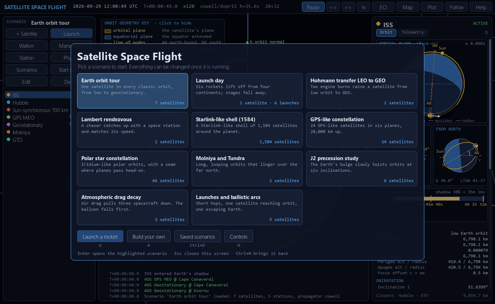
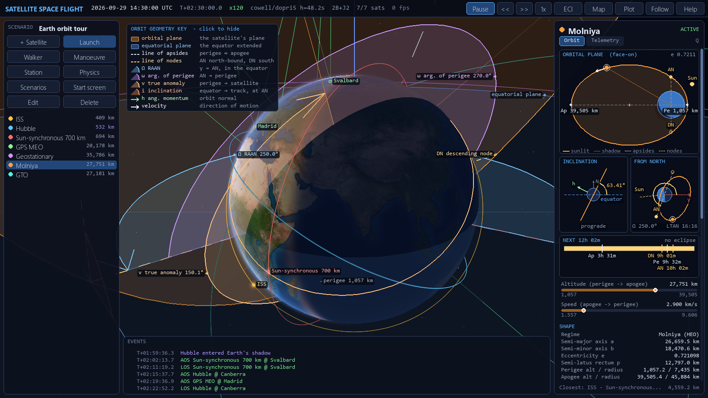
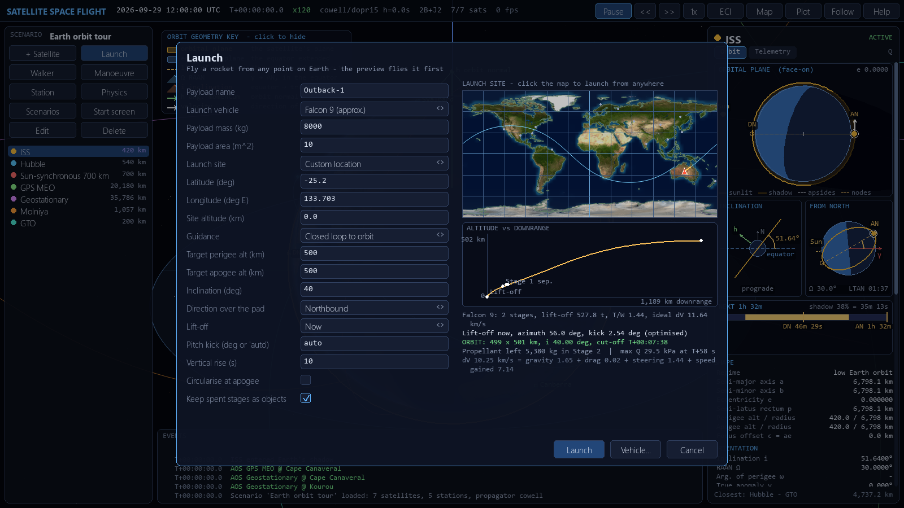
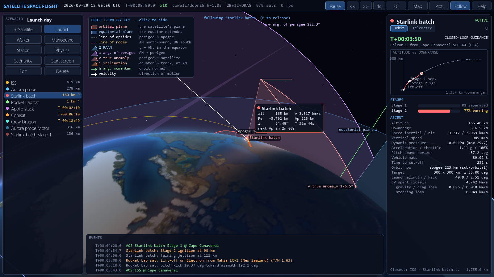

# Satellite Space Flight

An Earth-centred, fully 3-D satellite orbit simulator written entirely in
Python: a numpy physics engine plus an interactive **pygame** front end.
Build scenarios with any number of satellites in any orbits, or launch them
on multi-stage rockets from anywhere on Earth, then calculate and watch them
evolve under real perturbing forces.

## Start it

- **Windows:** double-click **`Start Satellite Space Flight.bat`** in this folder.
- **macOS:** double-click **`Start Satellite Space Flight.command`** (the first
  time, right-click it and choose *Open*).
- **Linux, or any terminal:** `python3 start.py`

All you need is [Python 3.10 or newer](https://www.python.org/downloads/). On
Windows, tick *Add python.exe to PATH* on the installer's first screen. The
first start installs numpy and pygame-ce by itself, which needs an internet
connection and takes about a minute. After that, it starts in a couple of
seconds.

The simulator opens on a start screen. Click a scenario to watch it, launch a
rocket, or build your own. `Ctrl+N` (or **Start screen** in the left panel)
brings the start screen back, and `H` lists every key. To open a scenario file
directly, drop it onto the Windows launcher.



<details>
<summary><b>If it does not start</b></summary>

- **"needs Python 3.10 or newer, and none was found"**: install Python from
  [python.org](https://www.python.org/downloads/) (Windows: tick *Add
  python.exe to PATH*), then double-click the launcher again.
- **Setup failed**: check the internet connection and start again. To rebuild
  from scratch, run `python start.py --reinstall`.
- **macOS says the file cannot be opened**: right-click it, choose *Open*, and
  confirm. If Terminal says *permission denied*, run
  `chmod +x "Start Satellite Space Flight.command"` once.
- **Where the setup goes**: if your Python already has numpy and pygame-ce,
  the launcher uses it and installs nothing. Otherwise it creates a private
  environment for this computer (Windows: `%LOCALAPPDATA%\SatelliteSpaceFlight`,
  macOS: `~/Library/Application Support/SatelliteSpaceFlight`, Linux:
  `~/.local/share/satellite-space-flight`). It stays outside the project
  folder, so a synced folder never carries it between machines. Delete that
  folder to remove it.

</details>

### From a terminal

```bash
pip install -r requirements.txt
python -m satflight                                   # start screen
python -m satflight scenarios/hohmann_to_geo.json     # straight into a scenario
```

The front end uses [pygame-ce](https://pyga.me), the maintained community
edition of pygame (same `import pygame` API; it also ships wheels for Python
3.13/3.14, which classic pygame does not yet). The optional
`pip install sgp4` gives proper SGP4 initialisation of TLEs. The Earth texture
(NASA Blue Marble) and coastlines (Natural Earth) are bundled in `assets/`;
`python tools/fetch_assets.py` re-downloads them.

## Gallery


| Hohmann transfer to GEO | 1,584-satellite Walker shell |
|---|---|
|  |  |
| **Molniya / Tundra in the Earth-fixed frame** | **J2 precession study with telemetry plot** |
|  |  |
| **Following the ISS over Canada** | **Orbit inspector: a Molniya satellite near apogee** |
|  |  |

## Launching from anywhere on Earth

Press `U` (or **Launch**) and fly a rocket from any point on the planet: pick
one of fifteen real launch complexes, type a latitude and longitude, or just
click the map. Choose a vehicle (Falcon 9, Electron, Saturn V, a sounding
rocket, or your own stages), the payload, and the orbit you want (perigee,
apogee, inclination, north- or southbound), then when to go: now, after a
delay, or at the next **launch window** into a plane of given RAAN or into
another satellite's plane.

The dialog flies the whole ascent on paper while you type and shows the
ground track, the altitude profile with its staging events, the orbit
reached, the propellant to spare and the delta-v budget (gravity, drag and
steering losses). If the rocket cannot make it, it says why.

Then the simulation flies it: the vehicle waits on its pad turning with the
Earth, lifts off, rises vertically, pitches over, flies a gravity turn
through the atmosphere, drops its first stage and fairing, and steers its
upper stage with closed-loop guidance to the requested orbit. At cut-off the
payload separates and orbits like any other satellite; the spent stages
become objects too, so the first stage falls back and re-enters while the
upper stage stays in orbit next to its payload. While it climbs, the right
panel shows the ascent: mission clock, stage propellant, altitude against
downrange (planned and flown), dynamic pressure, g-load, pitch, the orbit
taking shape and the time to cut-off.

| Launch dialog: a Falcon 9 from a clicked site in central Australia | Launch day: a Falcon 9 in its second-stage burn over Florida |
|---|---|
|  |  |

## What it simulates

**Dynamics** (all vectorised over the whole satellite ensemble)

- Two-body gravity plus zonal harmonics **J2, J3, J4**
- **Atmospheric drag** (piecewise-exponential atmosphere, co-rotating with the Earth, solar-activity scale factor)
- Impulsive burns and **finite-thrust burns** with propellant use (Tsiolkovsky)
- **Rocket launches**: multi-stage ascent with altitude-dependent thrust and Isp, drag,
  staging, fairing jettison, an optional g-limit, a gravity turn and closed-loop guidance

Only the Earth acts on the satellites. Sun and Moon gravity, solar radiation
pressure and the Moon itself are **out of the present scope**; the Sun's
position is still computed for lighting, eclipses, beta angle and local solar
time. [docs/SCOPE.md](docs/SCOPE.md) lists everything that was removed.

**Propagators**

| name | method | use |
|---|---|---|
| `cowell` | numerical integration of every enabled force: Dormand-Prince 5(4) adaptive (default), RK4, or symplectic leapfrog | accuracy, perturbation studies |
| `kepler` | exact analytic two-body motion (universal variables) | reference, very long runs |
| `j2mean` | analytic two-body + J2 secular drift of RAAN, perigee, mean anomaly | thousands of satellites |

**Initial conditions** - classical elements (a/e, perigee/apogee, or circular
altitude; `"i": "sso"` gives the sun-synchronous inclination), ECI state
vectors, **launch from the surface** (lat/lon/alt, ground speed, azimuth,
flight-path angle, including Earth-rotation velocity), geostationary slots,
TLEs, copies spread along an orbit, and **Walker delta/star constellations**.

**Mission planning** - Hohmann and bi-elliptic transfers, circularisation,
plane changes at the nodes, **Lambert rendezvous** (with an automatic search
for the cheapest time of flight whose arc stays above the atmosphere), and
arbitrary V/N/B or RSW or ECI impulses, each schedulable now, after a delay, or
at the next periapsis / apoapsis / ascending / descending node.

**Events** - manoeuvre execution, eclipse entry/exit, ground-station AOS/LOS,
close approaches between satellites, re-entry, surface impact and escape from
Earth's sphere of influence.

**Displays**

- 3-D view with a ray-traced, textured Earth lit by the true Sun: soft terminator with twilight band, sun glint on the oceans, atmospheric limb and halo that redden at sunset, exact Earth occlusion of orbits
- Star field with stellar colours and the Milky Way along the true galactic plane; the Sun
- Satellites glow in sunlight and dim when they pass into Earth's shadow
- Inertial (ECI) or Earth-fixed (ECEF) frame; follow-camera on any satellite
- Osculating orbits, perturbed trails, velocity vectors, apsides and node markers, coverage footprint, ground-station links
- 2-D ground-track map with day/night shading and the sub-solar point
- **Orbit inspector** for the clicked satellite. In 3-D: its translucent orbital plane slicing the globe, the equatorial plane, line of nodes (AN/DN), line of apsides with perigee and apogee altitudes, every angle (inclination, RAAN from the vernal equinox, argument of perigee, true anomaly, or argument of latitude for near-circular orbits) as a shaded wedge with an arrow showing which way it is measured, the angular-momentum and velocity vectors and a callout card beside the satellite. Every element is labelled by name and joined to what it marks; points behind the Earth keep a dimmed label, and a key in the corner of the view says what each element spans (click it to fold it away). In the *Orbit* tab: the orbital plane face-on to scale with the Earth's shadow cut through it, an edge-on inclination view, a view from the north pole with RAAN, the Sun and the local time of the ascending node, a timeline of the next revolution (sunlight, eclipse, apsis and node passes), altitude and speed gauges, and a property sheet: shape (a, b, e, p, apsides), orientation, timing (period, nodal period, track shift, time to the next perigee/apogee/node), speeds (perigee, apogee, circular, escape, C3), J2 drift, sun-synchronous inclination, beta angle, shadow fraction and the spacecraft's mass, area-to-mass, ballistic coefficient, and drag at perigee
- Telemetry tab: geodetic position, osculating elements, J2 drift rates, beta angle, illumination, **acceleration budget per force**, energy conservation check, propellant and delta-v, station look angles
- Time-history plots (altitude, speed, a, e, i, RAAN, argument of perigee, perigee height, energy drift)

## Controls

| input | action |
|---|---|
| left-drag / wheel | orbit / zoom camera (the wheel scrolls the right panel under the mouse); click a satellite to select and inspect it |
| arrow keys, `+` `-` | rotate / zoom camera |
| `Space`, `,` `.`, `1` | pause, slower/faster time warp, real time |
| `Tab` / `Shift+Tab`, `F` | next / previous satellite, follow it |
| `E` | ECI / ECEF frame |
| `O` `T` `L` `V` `X` `C` `R` `K` | orbits mode, trails, labels, vectors, axes, footprint, GEO ring, coastlines |
| `D`, `Q` | selected orbit's geometry (full / basic / off), right panel tab (orbit / telemetry) |
| `PgUp` `PgDn` `Home` `End` | scroll the right panel (or drag its scrollbar) |
| `M` `G` `I` | ground-track map, plot, hide panels |
| `A` `W` `B` `N` `P` | add satellite, Walker constellation, manoeuvre, ground station, physics |
| `U` | launch a rocket from anywhere on Earth |
| `Ctrl+N`, `Ctrl+O`, `Ctrl+S`, `Ctrl+R`, `Ctrl+Q` | start screen, scenarios, save snapshot, reset, quit |
| `Ctrl+E`, `Del`, `F12`, `H` / `F1` | edit / delete satellite, screenshot, help (`Esc` closes it) |

Rest the mouse on any button to see what it does and its keyboard shortcut.
Every dialog shows a live preview (resulting orbit, transfer delta-v, burn
duration) before you commit.

## Scenarios

Scenarios are JSON files (see [`satflight/scenario.py`](satflight/scenario.py)
for the format). Bundled examples, regenerated by
`python tools/make_scenarios.py`:

| file | shows |
|---|---|
| `default.json` | LEO, SSO, MEO, GEO, Molniya and GTO together |
| `hohmann_to_geo.json` | two-burn LEO to GEO transfer |
| `rendezvous.json` | Lambert intercept and velocity match |
| `starlink_shell.json` | 1584/72/17 Walker delta shell |
| `gps_constellation.json` | 24/6/1 MEO constellation |
| `polar_star.json` | Iridium-like Walker star with its seam |
| `drag_decay.json` | three ballistic coefficients at 300 km |
| `j2_precession.json` | nodal regression vs inclination, frozen perigee at 63.4 deg |
| `molniya_tundra.json` | HEO ground tracks and high-latitude coverage |
| `launches_and_arcs.json` | sub-orbital hops, orbit insertion, escape (burnout states) |
| `launch_day.json` | six rocket launches from four continents, one into the ISS plane |

"Save snapshot" writes the current state as a new scenario whose epoch is
the current simulation time (into `scenarios/user/`).

The start screen shows every bundled scenario with a plain-language line from
`CARDS` in [`satflight/ui/welcome.py`](satflight/ui/welcome.py); a new
bundled scenario needs a line there too (a test checks).

## Calculating without graphics

```bash
python -m satflight.batch scenarios/hohmann_to_geo.json --duration 8h --step 60 --out run.csv
```

prints a summary (final elements, delta-v, events) and writes position,
velocity, geodetic coordinates and osculating elements for every satellite at
every step. The engine is an ordinary library too:

```python
from satflight.scenario import Scenario
from satflight.simulation import Simulation
from satflight.maneuvers import Maneuver

sim = Simulation(Scenario.load("scenarios/default.json"))
sim.schedule(Maneuver("ISS", "impulse", dv=(0.010, 0, 0)))   # +10 m/s prograde
sim.advance(86400)
```

## Accuracy and validation

The physics is checked by 119 tests (`pytest`), including textbook reference
cases from Vallado's *Fundamentals of Astrodynamics and Applications*
(RV to elements, 40-minute Kepler propagation, GMST, Hohmann transfer), the
numerical integrator against the analytic solution (under 1 m after a day),
energy conservation with J2-J4, zonal accelerations against numerical
gradients of the geopotential, J2 nodal regression against theory
(sun-synchronous 0.9856 deg/day), Lambert solutions against propagated
arcs, the Sun's declination at solstice and equinox, launches reaching their
target orbits (to 5 km and 0.05 deg) and launch windows their RAAN, mass and
delta-v bookkeeping through staging, and headless drives of every UI dialog.
See [docs/PHYSICS.md](docs/PHYSICS.md) for the models, equations and the
approximations made.

## References

This project is standalone but draws on the models and conventions of:

- [astropy](https://www.astropy.org) - time scales and reference frames
- [skyfield](https://rhodesmill.org/skyfield/) / [sgp4](https://pypi.org/project/sgp4/) - TLE handling and SGP4
- [REBOUND](https://rebound.readthedocs.io) / REBOUNDx - integrator design (symplectic leapfrog, adaptive schemes) and additional-force structure
- D. A. Vallado, *Fundamentals of Astrodynamics and Applications*, 4th ed.
- O. Montenbruck & E. Gill, *Satellite Orbits*
- H. D. Curtis, *Orbital Mechanics for Engineering Students*

## Layout

```
satflight/            physics engine (numpy only)
  constants.py        WGS-84 / EGM-96 constants
  timeutil.py         Julian dates, GMST, clock
  frames.py           ECI, ECEF, geodetic, ENU, RSW, VNB
  elements.py         elements <-> state, anomalies, universal Kepler, conics
  forces.py           gravity, J2-J4, drag
  atmosphere.py       exponential atmosphere
  ephemeris.py        Sun position (lighting and eclipses only)
  eclipse.py          umbra / penumbra
  integrators.py      DOPRI5, RK4, leapfrog
  maneuvers.py        transfers, Lambert, manoeuvre objects
  launch.py           launch vehicles, ascent dynamics and guidance, launch windows
  planner.py          turns goals into scheduled burns
  analysis.py         J2 rates, footprints, classification, J2-mean propagator
  orbitinfo.py        derived properties for the orbit inspector (apsides, passes, eclipses, LTAN)
  scenario.py         JSON scenarios, presets, Walker constellations
  simulation.py       the engine: propagation, burns, events, history
  batch.py            headless runs and CSV export
  tle.py              TLE parsing (+ optional SGP4)
  ui/                 pygame front end
    app.py            window, main loop, input and time control
    welcome.py        start screen: scenario cards and ways in
    camera.py         perspective camera, projection and Earth occlusion
    render3d.py       3-D scene: stars, Sun, orbits, trails, satellites, stations
    earth.py          ray-traced, textured and sunlit Earth
    orbitviz.py       orbit-geometry overlay and callout for the selected satellite
    panels.py         top bar, satellite list, right panel, event log, help
    orbitpanel.py     Orbit tab: diagrams, timeline, gauges and property sheet
    launchui.py       Launch and Vehicle dialogs, ascent view
    dialogs.py        add satellite, Walker, manoeuvre, station, physics, scenarios
    groundtrack.py    2-D ground-track map
    plots.py          telemetry time-history plot
    widgets.py        buttons, text fields, choices and the form dialog
    theme.py          colours, fonts and drawing helpers
scenarios/            example scenarios
tools/                scenario and README-picture generators, asset downloader
tests/                pytest suite
start.py              launcher: sets up numpy and pygame-ce if needed, then starts
Start Satellite Space Flight.bat / .command    double-click launchers (Windows / macOS)
```

## Development

```bash
pip install -r requirements.txt
python -m pytest -q          # the test suite (the UI tests run headless)
python -m ruff check .       # lint: errors, bugs, import order, 100-column lines
```

The code is formatted by hand in a compact style, so `ruff format` is not
used. Scenario files are generated: change `tools/make_scenarios.py` and rerun
it rather than editing the JSON. The pictures in `docs/images/` are too: after a
visible UI change, run `python tools/make_screenshots.py`.

## License

Code: MIT - see [LICENSE](LICENSE).

Bundled data (both public domain): Earth texture from NASA Visible Earth
"Blue Marble" (NASA Goddard Space Flight Center); coastlines from
[Natural Earth](https://www.naturalearthdata.com) 1:110m.
